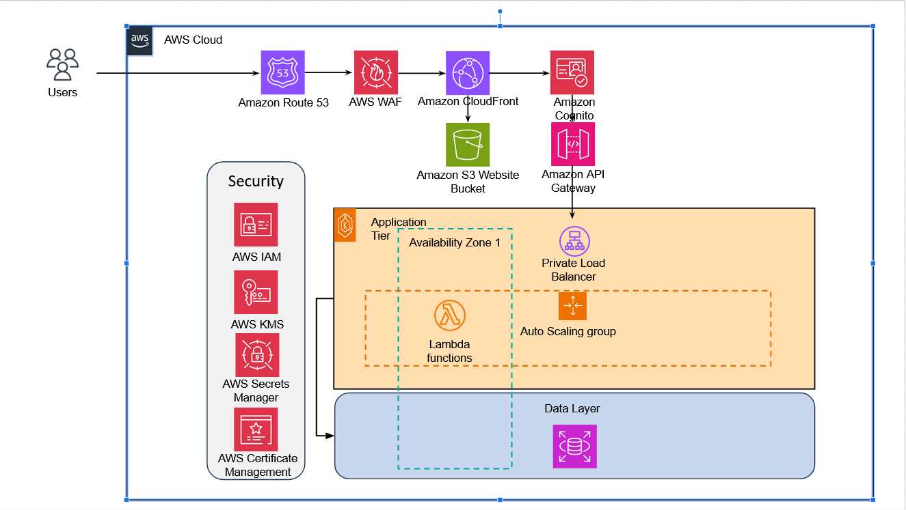

# Group project for ITSCM 451. 
Group: Tyler Deal, Tyler Smith, Kyle Muth
 
### Goals:
Your task is to develop a Serverless Order Processing System that allows customers to place orders for
products. The system should:
1. Handle customer data, order information, and product inventory.
2. Process orders in real-time, including stock validation and order confirmation.
3. Send notifications (email or SMS) to customers when their order is confirmed

### Additional Info:
The site uses only html, css, and javascript. All python code exists in AWS Lambda Functions.   
All code is AI generated and lightly tweaked. AI Code is an intended part of the assignment.   

## Quick Explainer
### Infrastructure: 
This is an e-commerce site that uses static site hosting on an S3 bucket for hosting the website. We use a combination of HTML, CSS, and Javascript for the front end code. On the back end, we are using AWS Lambda functions, which are triggered by JavaScript code. These Lambda functions interact directly a mySQL database on an EC2 instance. This databases stores all information needed for the website to run.    
    
### Security: 
We use Cognito to handle all user accounts on our website. This means that account passwords are encrypted. To ensure that no traffic is being sent unencrypted, we have TLS 1.2 configured. We have AWS Cloudfront to handle distribution of content, we have a web application firewall to block attacks. We also are using cloudflare to prevent DDOS attacks.    
    
We also are using IAM to ensure that created cognito users have the proper permissions and nothing more.   
   
### Refernce Architecture:

